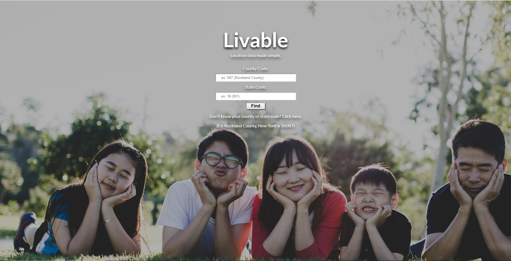
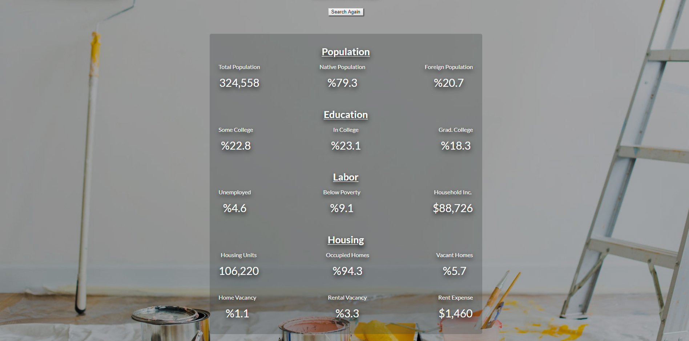
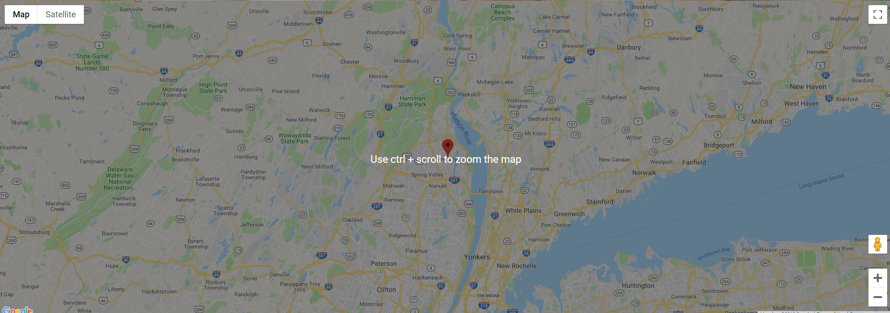
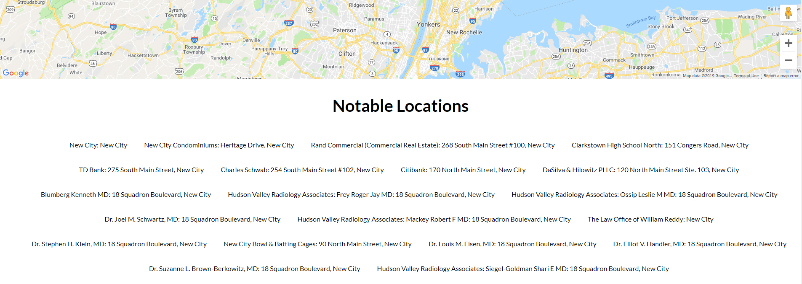

# Livable

A one-stop shop for the latest, location-specific census data. By entering county and state census codes, users can quickly obtain the housing, labor, education, and demographic status of a location they'd like to move to.

[Live Demo](https://jclk86.github.io/Livable/)

# Motivation

This app was created to make location-specific research simple for people looking to move and for property investors. 

# Challenges

Since each category of data fetched from the US Census Bureau's API had its own endpoint, all the data rendered at random times. Furthermore, the census bureau's API occasionally goes through backend changes, which meant some of the data may or may not render. Thus, to overcome these issues, not only was it necessary to use a Promise.all method for the fetches, but it was also important to implement the logical && operator and template strings in order to render feedback about failed fetches. 

# Screenshots

  
Home screen:

  

  
Data:

  

  
Map:

  

  
Notable Locations:

  

# Built With:
HTML, CSS, JavaScript, jQuery
