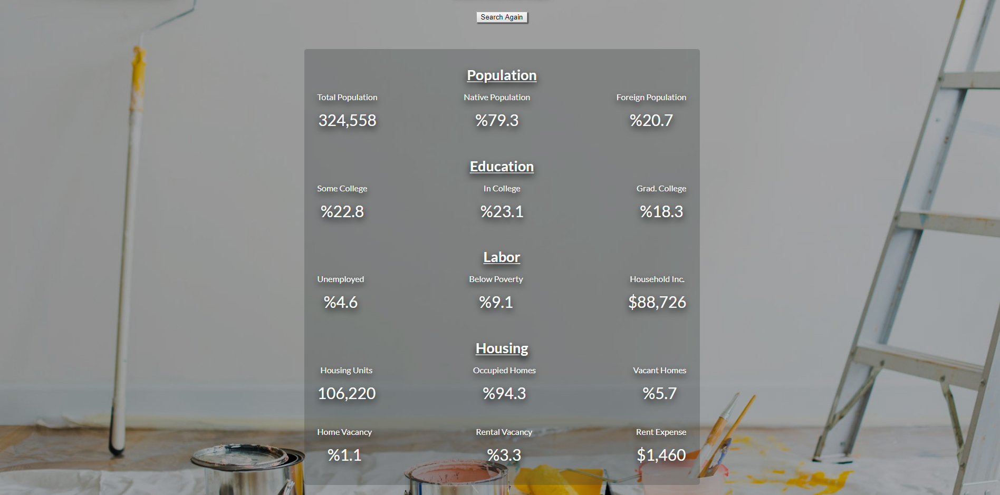
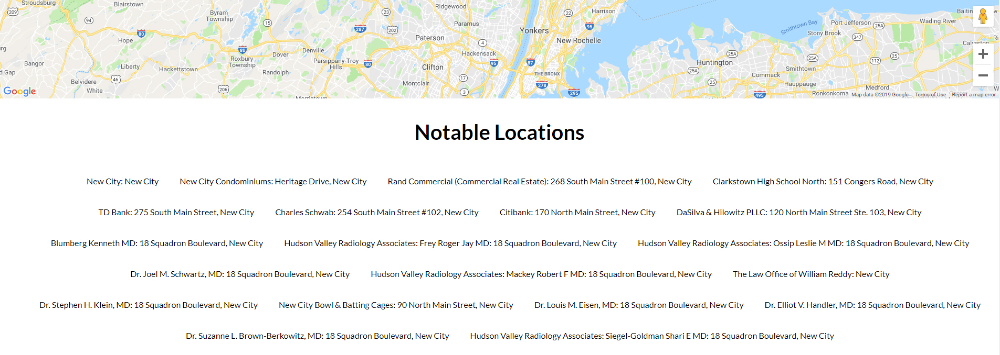

# Livable

A one-stop shop for the latest, location-specific census data. Users can quickly obtain the housing, labor, education, and demographic status of a location they'd like to move to by entering county and state code. 

[Live Demo](https://jclk86.github.io/Livable/)

# Motivation

This app was created to make location-specific research simple for people looking to move and property investors. 

# Screenshots

  
Home screen:

  

  
Data:

  

  
Map:

  

  
Notable Locations:

  

# Built With:
HTML, CSS, JavaScript, jQuery
